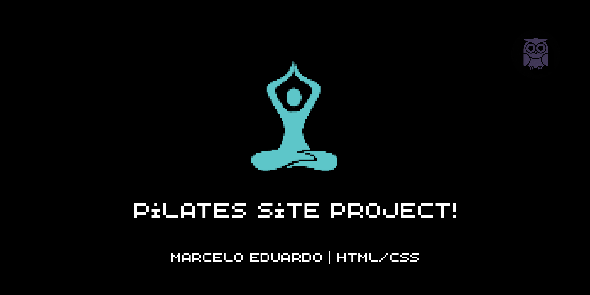
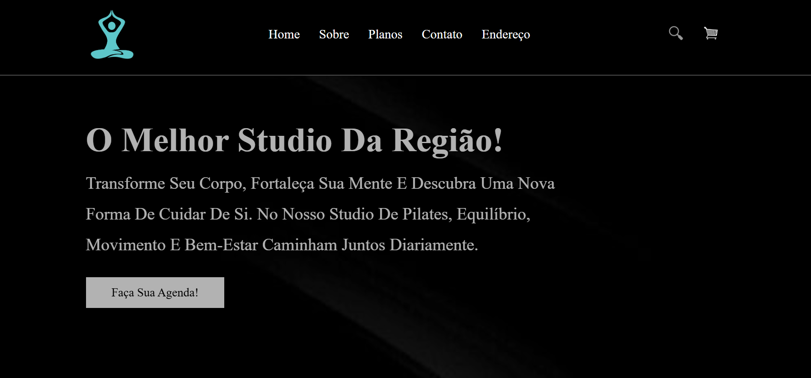

  

# 🧘 Pilates Club

> Landing page institucional desenvolvida para um Studio de Pilates, com foco em uma experiência visual moderna, elegante e intuitiva.

---

## 📌 Sobre o projeto

O **Pilates Club** é uma landing page desenvolvida para representar a presença digital de um Studio de Pilates.

O projeto foi pensado para apresentar o espaço de forma profissional, destacando seus diferenciais, planos, formas de contato e localização.

A proposta visual busca transmitir sensações de **equilíbrio, bem-estar, confiança e sofisticação**, utilizando uma interface limpa e organizada.

Além de funcionar como uma página institucional, o projeto também faz parte dos meus estudos e práticas em **desenvolvimento web**, permitindo aplicar conceitos de estruturação, estilização, responsividade e organização de código.

---

## 🎯 Objetivos

O principal objetivo do projeto é criar uma página que permita ao visitante:

* Conhecer o Studio de Pilates;
* Entender a proposta e os diferenciais do espaço;
* Visualizar os planos disponíveis;
* Encontrar informações de contato;
* Consultar a localização do Studio;
* Encontrar os canais de redes sociais;
* Ter acesso rápido às opções de agendamento.

---

## ✨ Funcionalidades

### 🏠 Página inicial

Apresentação do Studio através de uma seção inicial com identidade visual própria e chamada para ação.

### ℹ️ Sobre o Studio

Seção destinada à apresentação do espaço e dos seus diferenciais, destacando a proposta de oferecer uma experiência voltada ao bem-estar e à qualidade de vida.

### 💳 Planos

Apresentação dos planos oferecidos pelo Studio, permitindo que o visitante conheça as opções disponíveis antes de entrar em contato.

### 📞 Contato

Área destinada às informações de contato do Studio e aos canais disponíveis para comunicação.

### 📍 Localização

A página apresenta a localização do Studio através de um mapa, facilitando o acesso para novos clientes.

### 🔗 Redes sociais

Links para redes sociais foram incorporados à página para ampliar os canais de comunicação e divulgação do Studio.

---

## 🎨 Design

A identidade visual do projeto foi construída com uma abordagem **minimalista e moderna**.

A combinação de tons escuros, claros e azul/turquesa cria contraste e ajuda a transmitir uma sensação de:

* Equilíbrio;
* Tranquilidade;
* Elegância;
* Profissionalismo;
* Bem-estar.

A organização das seções também foi pensada para proporcionar uma navegação simples e objetiva.

---

## 🛠️ Tecnologias utilizadas

### HTML5

Utilizado para construir a estrutura e organizar semanticamente os elementos da página.

### CSS3

Utilizado para desenvolver a identidade visual, estilização, posicionamento dos elementos, layouts e adaptação da página para diferentes tamanhos de tela.

---

## 📱 Responsividade

O projeto foi desenvolvido considerando diferentes tamanhos de tela, buscando proporcionar uma experiência consistente para usuários de:

* 💻 Computadores;
* 📱 Smartphones;
* 📲 Tablets.

A responsividade faz parte da proposta do projeto para que as informações e elementos da página continuem acessíveis independentemente do dispositivo utilizado.

---

## 📸 Preview

---

## 🌐 Acesse o projeto

🔗 **GitHub Pages:**
Em breve.

---

## 📚 O que eu aprendi

O desenvolvimento deste projeto permitiu colocar em prática diversos conceitos de desenvolvimento web, incluindo:

* Estruturação de páginas com HTML5;
* Organização semântica de conteúdo;
* Estilização com CSS3;
* Criação de layouts;
* Organização de seções;
* Trabalhos com imagens;
* Criação de menus de navegação;
* Desenvolvimento de chamadas para ação;
* Responsividade;
* Organização de arquivos;
* Construção de uma landing page;
* Publicação de projetos utilizando GitHub Pages.

---

## 🚀 Próximos passos

O projeto pode continuar evoluindo futuramente com a implementação de novas funcionalidades, como:

* [ ] Adicionar JavaScript para interações;
* [ ] Implementar um formulário de contato funcional;
* [ ] Criar um sistema de agendamento;
* [ ] Integrar os botões de contato a um canal de atendimento;
* [ ] Adicionar animações e transições;
* [ ] Aprimorar a acessibilidade;
* [ ] Melhorar continuamente a experiência em dispositivos móveis.

---

## 💡 Objetivo como projeto de portfólio

Este projeto faz parte da minha jornada de aprendizado em desenvolvimento de software.

Através de projetos como este, busco transformar os conhecimentos adquiridos durante meus estudos em aplicações práticas, desenvolvendo não apenas minhas habilidades técnicas, mas também minha capacidade de criar interfaces organizadas e voltadas à experiência do usuário.

---

## 👨‍💻 Autor

**Marcelo Eduardo**

🎓 Estudante de **Análise e Desenvolvimento de Sistemas**

💻 Desenvolvendo projetos pessoais para aprimorar meus conhecimentos em programação e desenvolvimento web.

---

## ⭐ Feedback

Se você gostou do projeto ou tiver alguma sugestão de melhoria, fique à vontade para contribuir ou entrar em contato.

**Obrigado por visitar o projeto! 🚀**

---

💼 Meu LinkedIn: [LinkedIn](https://www.linkedin.com/in/marcelo-eduardo-a03978246/)

💻 Meu GitHub: [GitHub](https://github.com/eduardomarcelo628-beep)
